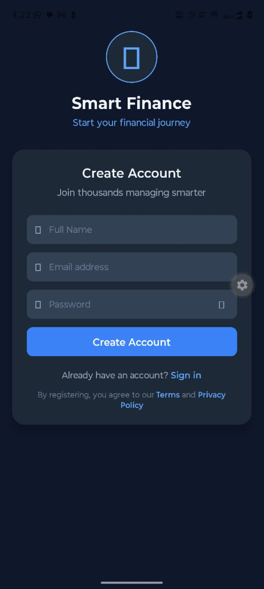
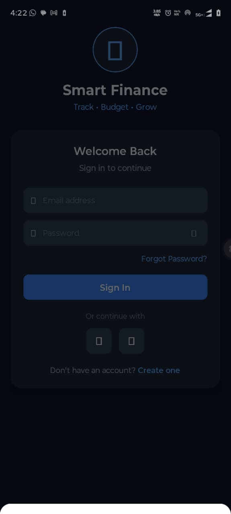
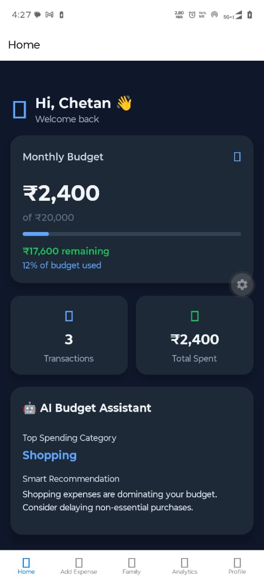
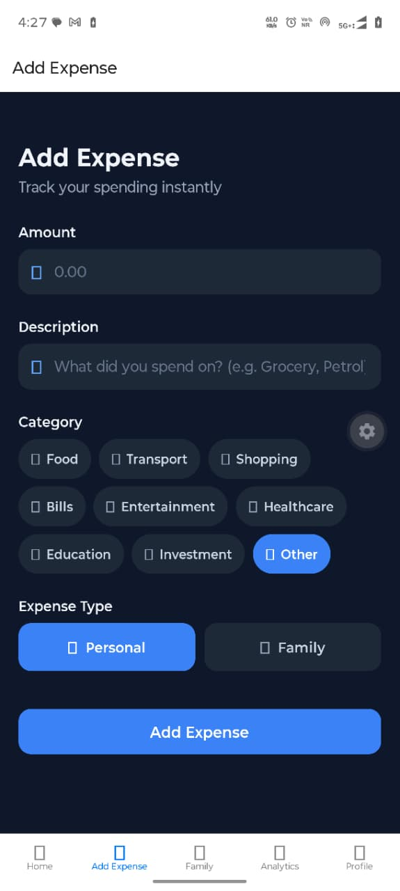
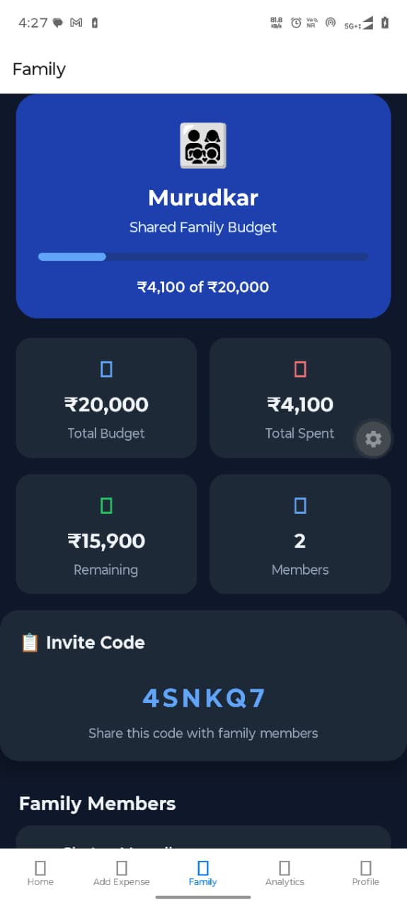
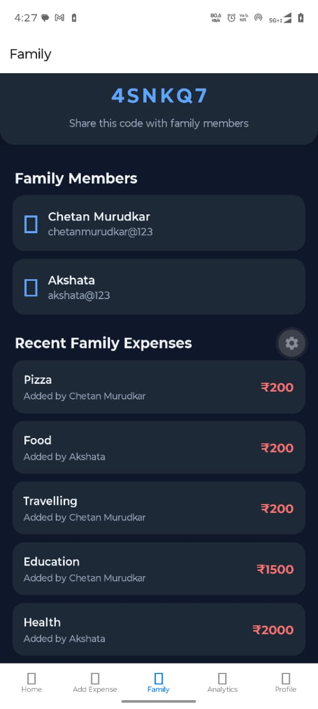
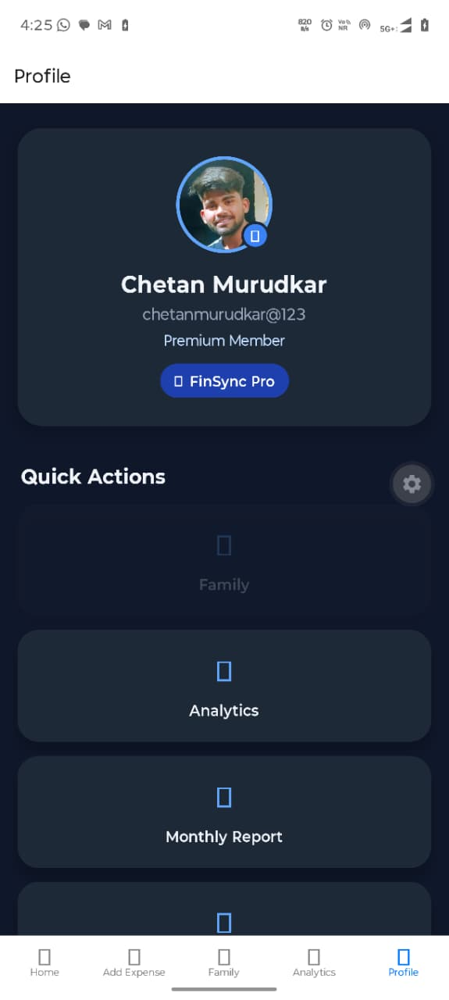

# FinSync OS

AI-powered personal finance management platform built with React Native, Node.js, Express.js, and MongoDB.

## Overview

FinSync OS helps users manage personal finances through smart expense tracking, budget management, analytics, and AI-powered financial insights.

## Features

* User Authentication (JWT)
* Personal Expense Tracking
* Monthly Budget Management
* AI Expense Categorization
* AI Budget Assistant
* Family Finance Management
* Family Expense Tracking
* Analytics Dashboard
* Smart Financial Insights
* Professional Mobile UI

## Tech Stack

### Frontend

* React Native (Expo)

### Backend

* Node.js
* Express.js

### Database

* MongoDB

### Authentication

* JWT

### AI Integration

* Gemini AI

---

## Application Screenshots

### Login Screen

### Register Screen

### Home Screen

### Home Dashboard

### Add Expense Screen

### Family Management

### Family Members

### Analytics Dashboard

### Profile Screen

### Profile Features

---

## Project Architecture

Frontend (React Native)
↓
REST API (Express.js)
↓
MongoDB Database
↓
AI Categorization Engine

---

## Current Features Status

* Authentication ✅
* Expense Tracking ✅
* Budget Management ✅
* Family Finance ✅
* Dashboard ✅
* AI Categorization ✅
* Analytics Dashboard 🚧
* PDF Reports 🚧
* Spending Prediction AI 📌

---

## Future Enhancements

* PDF Financial Reports
* AI Spending Prediction
* Advanced Financial Analytics
* Savings Goal Tracking
* Investment Insights

---

## Author

Chetan Murudkar

Final Year Project – FinSync OS
